# Appliance Reference

This document describes every appliance type in the system, its purpose, the events it monitors, and its complete state machine.

> **State machine mechanics**
> - `get_new_state` — copies events into the target state class without re-running the machine (instant jump)
> - `compute_new_state` — rebuilds the target state by replaying current events through the full machine (natural resolution)
> - `forced=Not` / `forced=Off` / `forced=Not` in a forced state → `compute_new_state("base", …)` — "un-force": recompute the natural state from current events
> - `unforce()` — automatic unlock triggered by a sensor event when the machine detects that the forced and natural states agree

---

## Table of Contents

1. [Light — Simple](#1-light--simple)
2. [Light — Zone](#2-light--zone)
3. [Light — Indoor Dimmerable](#3-light--indoor-dimmerable)
4. [Light — Presence](#4-light--presence)
5. [Socket — Presence](#5-socket--presence)
6. [Socket — Presence Christmas](#6-socket--presence-christmas)
7. [Socket — Energy Guard](#7-socket--energy-guard)
8. [Sprinkler](#8-sprinkler)
9. [Curtain — Indoor Blackout](#9-curtain--indoor-blackout)
10. [Curtain — Outdoor](#10-curtain--outdoor)
11. [Curtain — Outdoor Bedroom](#11-curtain--outdoor-bedroom)
12. [Thermostat — Presence](#12-thermostat--presence)
13. [Sensor — Motion](#13-sensor--motion)
14. [Sensor — Alarm](#14-sensor--alarm)
15. [Sensor — Rainmeter](#15-sensor--rainmeter)
16. [Sensor — Scene](#16-sensor--scene)

---

## 1. Light — Simple

**Module:** `home.appliance.light`

A sun-aware courtesy light. It turns on automatically when the room is dark and a courtesy signal is active, and off again when the room is bright or the courtesy signal drops. The user can override the automation in either direction with a forced event.

### Monitored events

| Event | Values |
|-------|--------|
| `event.courtesy` | `On`, `Off` |
| `event.sun.brightness` | `Bright`, `Dark`, `DeepDark` |
| `appliance.light.event.forced` | `Not`, `On`, `Off` |

### State machine

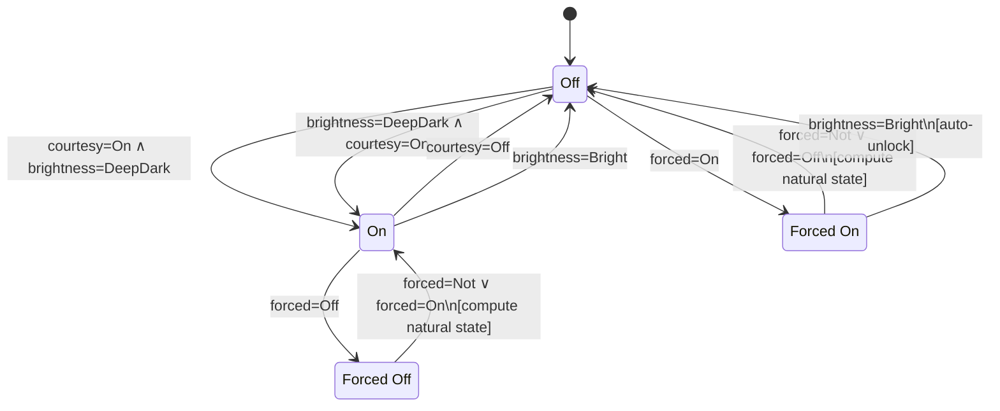

### Transitions summary

| From | Event | Condition | To |
|------|-------|-----------|-----|
| Off | courtesy=On | brightness=DeepDark | On |
| Off | brightness=DeepDark | courtesy=On | On |
| Off | forced=On | — | Forced On |
| On | courtesy=Off | — | Off |
| On | brightness=Bright | — | Off |
| On | forced=Off | — | Forced Off |
| Forced On | forced=Not \| Off | — | natural state (Off or On) |
| Forced On | brightness=Bright | natural=Off | Off (auto-unlock) |
| Forced Off | forced=Not \| On | — | natural state |

---

## 2. Light — Zone

**Module:** `home.appliance.light.zone`

A multi-purpose zone light that also participates in the alarm system. When the alarm is armed it enters a dedicated "alarmed" sub-mode that ignores the normal sun/presence logic. A toggle event switches the alarmed light between blinking-off and blinking-on patterns. The forced states resist automatic unlocking except for a rising sun brightness or an armed-alarm event.

### Monitored events

| Event | Values |
|-------|--------|
| `event.presence` | `On`, `Off` |
| `event.courtesy` | `On`, `Off` |
| `event.sun.brightness` | `Bright`, `Dark`, `DeepDark` |
| `event.alarm.armed` | `On`, `Off` |
| `event.toggle` | `On`, `Off` |
| `appliance.light.zone.event.forced` | `Not`, `On`, `Off` |

### State machine

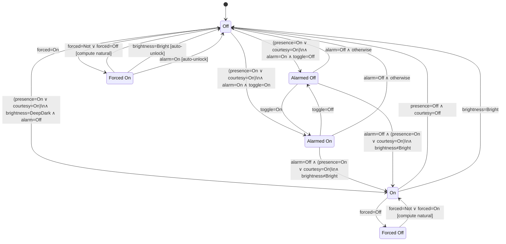

### Transitions summary

| From | Event | Condition | To |
|------|-------|-----------|-----|
| Off | presence=On \| courtesy=On | brightness=DeepDark, alarm=Off | On |
| Off | presence=On \| courtesy=On | alarm=On, toggle=Off | Alarmed Off |
| Off | presence=On \| courtesy=On | alarm=On, toggle=On | Alarmed On |
| Off | forced=On | — | Forced On |
| On | presence=Off | courtesy=Off | Off |
| On | brightness=Bright | presence=On \| courtesy=On | Off |
| On | forced=Off | — | Forced Off |
| Alarmed On | toggle=Off | — | Alarmed Off |
| Alarmed Off | toggle=On | — | Alarmed On |
| Alarmed On/Off | alarm=Off | presence/courtesy On, not bright | On |
| Alarmed On/Off | alarm=Off | otherwise | Off |
| Forced On | forced=Not \| Off | — | natural state |
| Forced On | brightness=Bright \| alarm=On | natural=Off | Off (auto-unlock) |
| Forced Off | forced=Not \| On | — | natural state |

---

## 3. Light — Indoor Dimmerable

**Module:** `home.appliance.light.indoor.dimmerable`

A fully user-controlled dimmerable light. There is no automatic on/off logic based on sensors; all state changes are driven by explicit forced events. Four operating modes are available: plain on, circadian rhythm (brightness follows time of day), lux balance (adjusts to maintain a target lux level), and show (fixed show scene). Presence leaving the room is the only sensor event that can auto-unlock a forced state.

### Monitored events

| Event | Values |
|-------|--------|
| `event.presence` | `On`, `Off` |
| `event.sun.brightness` | `Bright`, `Dark`, `DeepDark` |
| `appliance.light.indoor.dimmerable.event.forced` | `Not`, `On`, `CircadianRhythm`, `LuxBalance`, `Show` |

### State machine

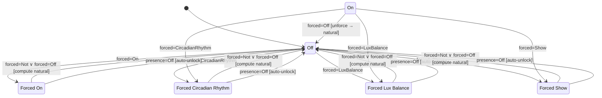

### Transitions summary

| From | Event | Condition | To |
|------|-------|-----------|-----|
| Off | forced=On | — | Forced On |
| Off | forced=CircadianRhythm | — | Forced Circadian Rhythm |
| Off | forced=LuxBalance | — | Forced Lux Balance |
| Off | forced=Show | — | Forced Show |
| Any forced state | forced=Not \| Off | — | natural state (Off) |
| Any forced state | presence=Off | natural=Off | Off (auto-unlock) |

---

## 4. Light — Presence

**Module:** `home.appliance.light.presence`

A minimal light that can only be turned on manually. It switches off automatically when all occupants leave. Useful for devices that should never be left on in an empty room.

### Monitored events

| Event | Values |
|-------|--------|
| `event.presence` | `On`, `Off` |
| `appliance.light.presence.event.forced` | `Not`, `On`, `Off` |

### State machine

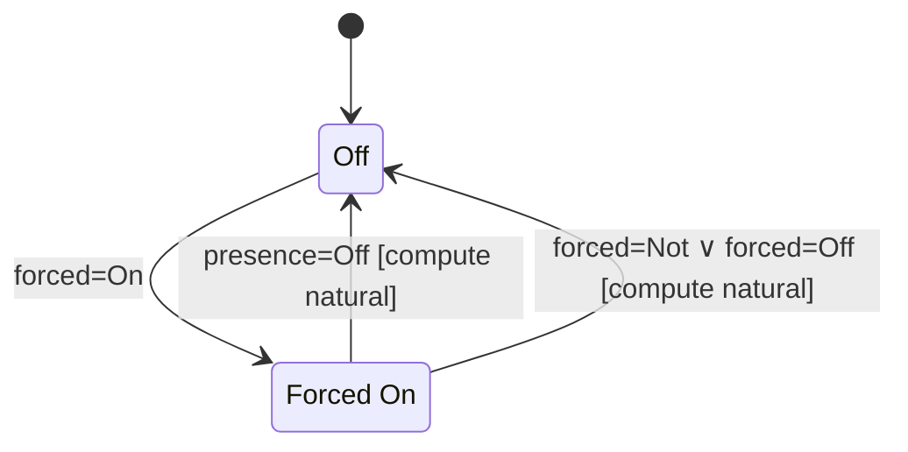

### Transitions summary

| From | Event | Condition | To |
|------|-------|-----------|-----|
| Off | forced=On | — | Forced On |
| Forced On | presence=Off | — | natural state (Off) |
| Forced On | forced=Not \| Off | — | natural state (Off) |

---

## 5. Socket — Presence

**Module:** `home.appliance.socket.presence`

A socket that is always off by default and must be explicitly turned on. It automatically cuts power when the house is empty, preventing devices from running unattended.

### Monitored events

| Event | Values |
|-------|--------|
| `event.presence` | `On`, `Off` |
| `appliance.socket.presence.event.forced` | `Not`, `On`, `Off` |

### State machine

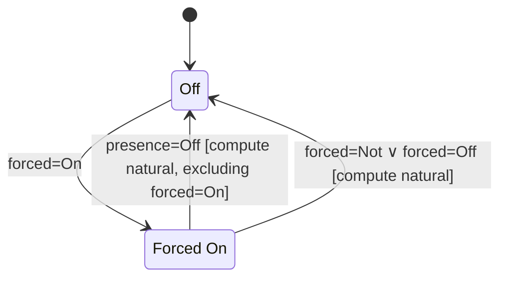

### Transitions summary

| From | Event | Condition | To |
|------|-------|-----------|-----|
| Off | forced=On | — | Forced On |
| Forced On | presence=Off | — | natural state (Off) |
| Forced On | forced=Not \| Off | — | natural state (Off) |

---

## 6. Socket — Presence Christmas

**Module:** `home.appliance.socket.presence.christmas`

A decorative socket for Christmas lights and similar seasonal devices. It turns on automatically during specific holiday periods (Christmas, New Year's Eve / San Silvestro, Epiphany) and at night when someone is home, and off again when the holiday is over, it is daylight, or the house is empty outside a holiday period.

### Monitored events

| Event | Values |
|-------|--------|
| `event.presence` | `On`, `Off` |
| `event.sun.brightness` | `Bright`, `Dark`, `DeepDark` |
| `event.holiday.christmas` | `Time`, `Eve`, `Day`, `Over` |
| `event.holiday.san_silvester` | `Eve`, `Day`, `Over` |
| `event.holiday.epiphany` | `Eve`, `Day`, `Over` |
| `appliance.socket.presence.christmas.event.forced` | `Not`, `On`, `Off` |

### State machine

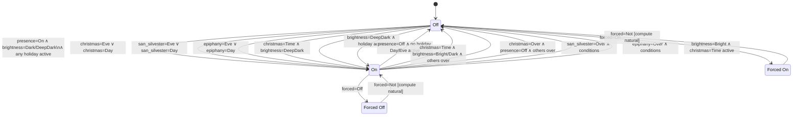

### Transitions summary

| From | Trigger | To |
|------|---------|-----|
| Off | presence=On + dark + holiday active | On |
| Off | Christmas / San Silvester / Epiphany Eve or Day | On |
| Off | forced=On | Forced On |
| On | presence=Off outside active holiday | Off |
| On | holiday ends (Over) + presence absent + others ended | Off |
| On | brightness=Bright during christmas=Time | Off |
| On | forced=Off | Forced Off |
| Forced On | forced=Not | natural state |
| Forced Off | forced=Not | natural state |

---

## 7. Socket — Energy Guard

**Module:** `home.appliance.socket.energy_guard`

A high-priority socket for power-hungry appliances (e.g. washing machine, dishwasher). It starts **On** and monitors power consumption. When consumption is persistently high it enters a **Detachable** warning state; if the guard is enabled and power stays high for a long duration the socket switches **Off** to shed load. It re-enables automatically when consumption returns to normal. The user can force it on or off at any time.

### Monitored events

| Event | Values |
|-------|--------|
| `event.power.consumption` | `High`, `Low`, `No` |
| `event.power.consumption.duration` | `Long`, `Short` |
| `event.enable` | `On`, `Off` |
| `appliance.socket.energy_guard.event.forced` | `Not`, `On`, `Off` |

### State machine

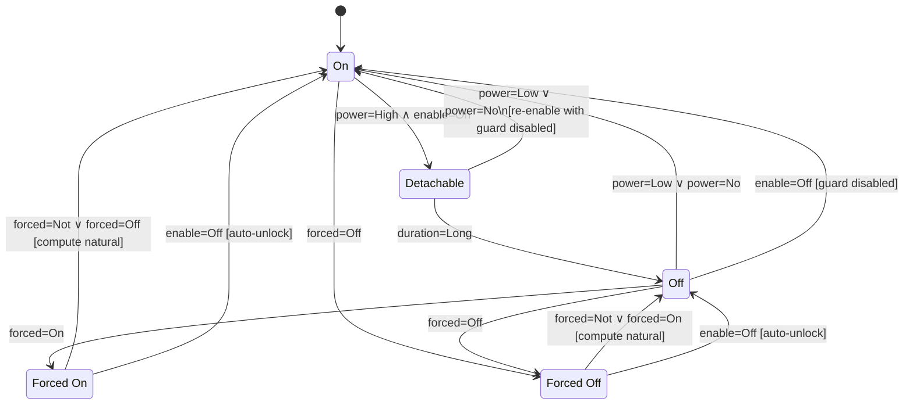

### Transitions summary

| From | Event | Condition | To |
|------|-------|-----------|-----|
| On | power=High | enable=On | Detachable |
| On | forced=Off | — | Forced Off |
| Detachable | power=Low/No | enable=On | On (guard disabled) |
| Detachable | duration=Long | — | Off |
| Off | power=Low/No | — | On |
| Off | enable=Off | — | On |
| Off | forced=On | — | Forced On |
| Off | forced=Off | — | Forced Off |
| Forced On | forced=Not \| Off | — | natural state (On) |
| Forced On | enable=Off | natural=On | On (auto-unlock) |
| Forced Off | forced=Not \| On | — | natural state (Off) |
| Forced Off | enable=Off | natural=Off | Off (auto-unlock) |

---

## 8. Sprinkler

**Module:** `home.appliance.sprinkler`

An automated garden sprinkler that activates at **Sunset** (if enabled) and deactivates at **Sunrise**. Rain conditions determine whether watering runs at full rate (**On**) or reduced rate (**Partially On**): if it has rained recently or rain is forecast, the system automatically reduces watering. If it is actively raining, the system stops entirely. The user can force any of the three watering modes or force it off.

### Monitored events

| Event | Values |
|-------|--------|
| `event.enable` | `On`, `Off` |
| `event.sun.phase` | `Sunrise`, `Sunset` |
| `event.rain` | `Gentle` (raining now), `No` |
| `event.rain.in_the_past` | `On`, `Off` |
| `event.rain.forecast` | `On`, `Off` |
| `appliance.sprinkler.event.forced` | `Not`, `On`, `PartiallyOn`, `Off` |

### State machine

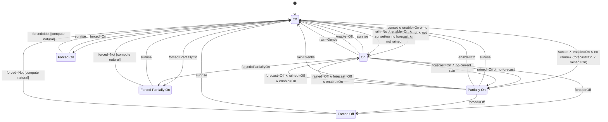

### Transitions summary

| From | Event | Condition | To |
|------|-------|-----------|-----|
| Off | sunset | enable=On, no rain, no forecast, not rained | On |
| Off | sunset | enable=On, no rain, forecast=On or rained=On | Partially On |
| Off | forced=On | — | Forced On |
| Off | forced=PartiallyOn | — | Forced Partially On |
| On | sunrise | — | Off |
| On | enable=Off | — | Off |
| On | rain=Gentle | — | Off |
| On | rained=On | no forecast | Partially On |
| On | forecast=On | not raining | Partially On |
| On | forced=Off | — | Forced Off |
| Partially On | sunrise | — | Off |
| Partially On | rained=Off + forecast=Off | enable=On | On |
| Partially On | rain=Gentle | — | Off |
| Any forced | sunrise | — | Off |
| Any forced | forced=Not | — | natural state |

---

## 9. Curtain — Indoor Blackout

**Module:** `home.appliance.curtain.indoor.blackout`

A bedroom blackout curtain. It closes automatically at civil sunset (or when the user falls asleep) and opens again at civil sunrise when the occupant is awake or sleepy (but not asleep). The forced states can be used to keep the curtain open or closed regardless of sun/sleep events.

### Monitored events

| Event | Values |
|-------|--------|
| `event.sun.twilight.civil` | `Sunrise`, `Sunset` |
| `event.sleepiness` | `Awake`, `Sleepy`, `Asleep` |
| `appliance.curtain.indoor.blackout.event.forced` | `Not`, `Opened`, `Closed` |

### State machine

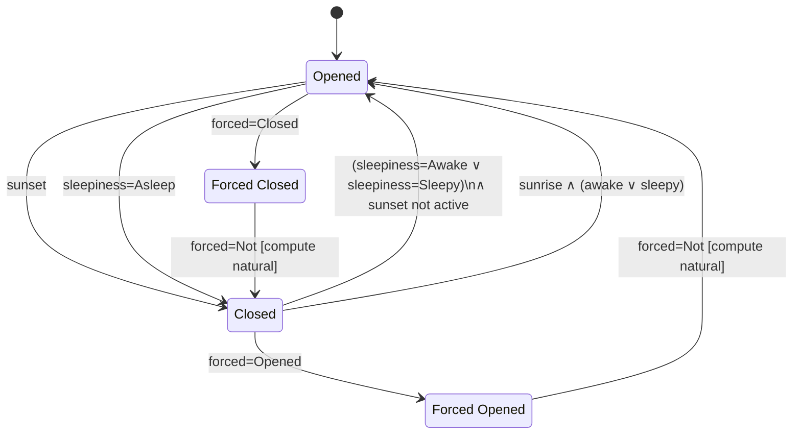

### Transitions summary

| From | Event | Condition | To |
|------|-------|-----------|-----|
| Opened | sunset | — | Closed |
| Opened | sleepiness=Asleep | — | Closed |
| Opened | forced=Closed | — | Forced Closed |
| Closed | sleepiness=Awake \| Sleepy | no sunset active | Opened |
| Closed | sunrise | awake or sleepy | Opened |
| Closed | forced=Opened | — | Forced Opened |
| Forced Opened | forced=Not | — | natural state |
| Forced Closed | forced=Not | — | natural state |

---

## 10. Curtain — Outdoor

**Module:** `home.appliance.curtain.outdoor`

An outdoor sun/wind protection curtain. It closes to shade the room when the sun is bright and hitting the window, or at sunset. It opens again at sunrise, when the sun leaves the window, when it gets dark, or when the wind is strong enough to risk damage.

### Monitored events

| Event | Values |
|-------|--------|
| `event.sun.twilight.civil` | `Sunrise`, `Sunset` |
| `event.sun.brightness` | `Bright`, `Dark`, `DeepDark` |
| `event.sun.hit` | `Sunhit`, `Sunleft` |
| `event.wind` | `Weak`, `Strong` |
| `appliance.curtain.outdoor.event.forced` | `Not`, `Opened`, `Closed` |

### State machine

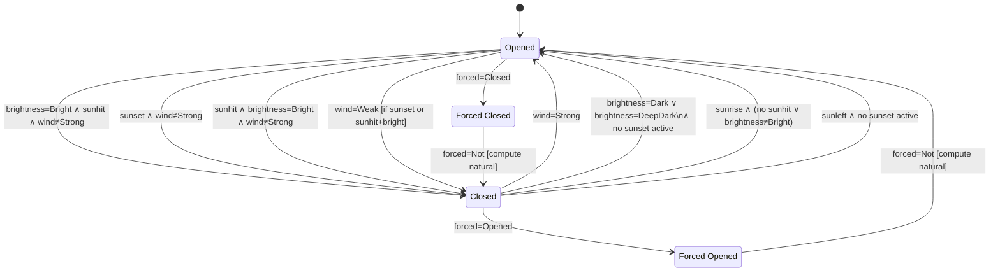

### Transitions summary

| From | Event | Condition | To |
|------|-------|-----------|-----|
| Opened | brightness=Bright | sunhit, wind≠Strong | Closed |
| Opened | sunset | wind≠Strong | Closed |
| Opened | sunhit | brightness=Bright, wind≠Strong | Closed |
| Opened | wind=Weak | sunset or (sunhit+bright) already active | Closed |
| Opened | forced=Closed | — | Forced Closed |
| Closed | wind=Strong | — | Opened |
| Closed | brightness=Dark/DeepDark | no sunset | Opened |
| Closed | sunrise | no sunhit or not bright | Opened |
| Closed | sunleft | no sunset | Opened |
| Closed | forced=Opened | — | Forced Opened |
| Forced Opened/Closed | forced=Not | — | natural state |

---

## 11. Curtain — Outdoor Bedroom

**Module:** `home.appliance.curtain.outdoor.bedroom`

An outdoor curtain for a bedroom window. Combines sun/wind protection with sleep awareness: it closes when the user falls asleep (in addition to normal solar triggers) and re-opens when the user wakes up. Like the plain outdoor curtain, strong wind always opens it.

### Monitored events

| Event | Values |
|-------|--------|
| `event.sun.twilight.civil` | `Sunrise`, `Sunset` |
| `event.sun.brightness` | `Bright`, `Dark`, `DeepDark` |
| `event.sun.hit` | `Sunhit`, `Sunleft` |
| `event.wind` | `Weak`, `Strong` |
| `event.sleepiness` | `Awake`, `Sleepy`, `Asleep` |
| `appliance.curtain.outdoor.bedroom.event.forced` | `Not`, `Opened`, `Closed` |

### State machine

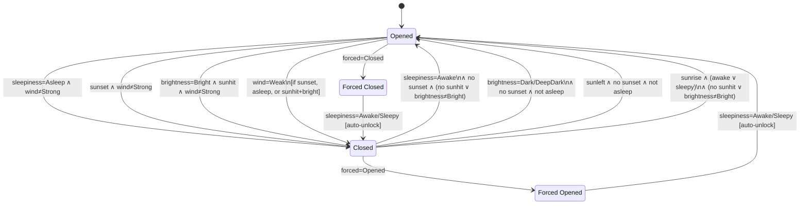

### Transitions summary

| From | Event | Condition | To |
|------|-------|-----------|-----|
| Opened | sleepiness=Asleep | wind≠Strong | Closed |
| Opened | sunset | wind≠Strong | Closed |
| Opened | brightness=Bright | sunhit, wind≠Strong | Closed |
| Opened | wind=Weak | sunset or asleep or sunhit+bright | Closed |
| Opened | forced=Closed | — | Forced Closed |
| Closed | sleepiness=Awake | no sunset, no sunhit or not bright | Opened |
| Closed | brightness=Dark/DeepDark | no sunset, not asleep | Opened |
| Closed | sunleft | no sunset, not asleep | Opened |
| Closed | sunrise | awake or sleepy, no sunhit or not bright | Opened |
| Closed | forced=Opened | — | Forced Opened |
| Forced Opened | sleepiness=Awake \| Sleepy | natural=Opened | Opened (auto-unlock) |
| Forced Closed | sleepiness=Awake \| Sleepy | natural=Opened | Opened (auto-unlock) |

---

## 12. Thermostat — Presence

**Module:** `home.appliance.thermostat.presence`

A presence-aware thermostat controller with three automatic modes: **Off** (no heating/cooling), **On** (active conditioning when someone is home), and **Keep** (setback/frost-guard mode when the house is empty or in hold). Any mode can be forced by the user; a dedicated **Forced Keep** mode is available to hold the keep setpoint manually.

### Monitored events

| Event | Values |
|-------|--------|
| `event.presence` | `On`, `Off` |
| `event.clima.command` | `On`, `Keep`, `Off` |
| `appliance.thermostat.presence.event.forced` | `Not`, `On`, `Off`, `Keep` |

### State machine

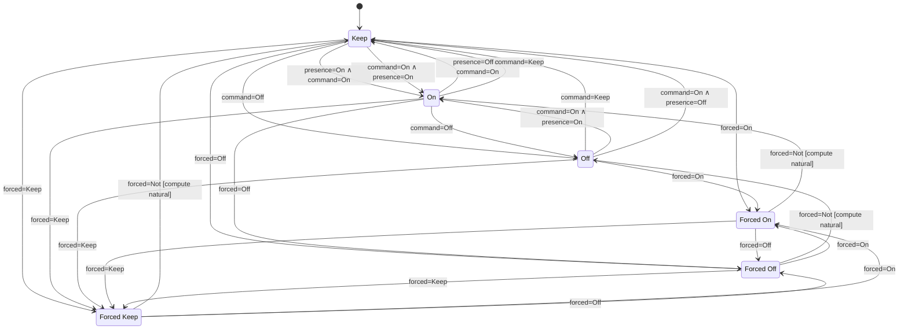

### Transitions summary

| From | Event | Condition | To |
|------|-------|-----------|-----|
| Keep | command=On | presence=On | On |
| Keep | command=Off | — | Off |
| Keep | presence=On | command=On | On |
| Off | command=On | presence=On | On |
| Off | command=On | presence=Off | Keep |
| Off | command=Keep | — | Keep |
| On | command=Keep | — | Keep |
| On | command=Off | — | Off |
| On | presence=Off | command=On | Keep |
| Any | forced=On | — | Forced On |
| Any | forced=Off | — | Forced Off |
| Any | forced=Keep | — | Forced Keep |
| Forced On/Off/Keep | forced=Not | — | natural state |

---

## 13. Sensor — Motion

**Module:** `home.appliance.sensor.motion`

A simple motion detector that mirrors the raw motion sensor signal. It has no forced states and no hysteresis — it transitions immediately on each motion event.

### Monitored events

| Event | Values |
|-------|--------|
| `event.motion` | `Spotted`, `Missed` |

### State machine

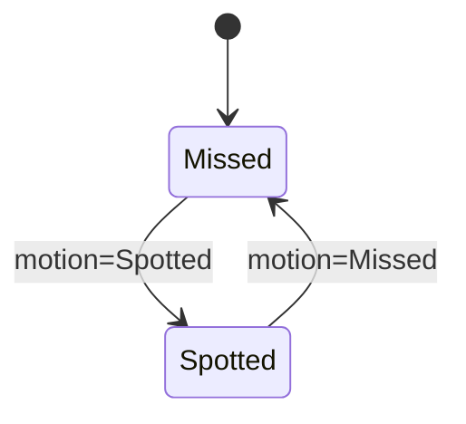

---

## 14. Sensor — Alarm

**Module:** `home.appliance.sensor.alarm`

An alarm state tracker. It moves to **Armed** when the alarm system arms (provided no trigger is currently active) and to **Triggered** when a sensor fires while armed. The triggered state is cleared only when the trigger signal ends; the resulting state (Armed or Unarmed) depends on whether the arm signal is still active.

### Monitored events

| Event | Values |
|-------|--------|
| `event.alarm.armed` | `On`, `Off` |
| `event.alarm.triggered` | `On`, `Off` |

### State machine

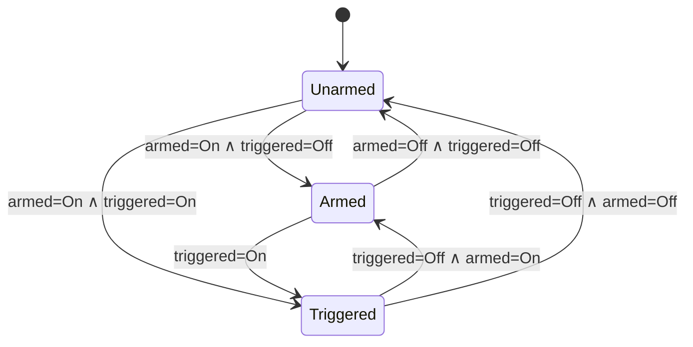

### Transitions summary

| From | Event | Condition | To |
|------|-------|-----------|-----|
| Unarmed | armed=On | triggered=Off | Armed |
| Unarmed | armed=On | triggered=On | Triggered |
| Armed | armed=Off | triggered=Off | Unarmed |
| Armed | triggered=On | — | Triggered |
| Triggered | triggered=Off | armed=On | Armed |
| Triggered | triggered=Off | armed=Off | Unarmed |

---

## 15. Sensor — Rainmeter

**Module:** `home.appliance.sensor.rainmeter`

Tracks whether it is currently raining. Used as an input event source by the Sprinkler appliance and outdoor curtains.

### Monitored events

| Event | Values |
|-------|--------|
| `event.rain` | `Gentle`, `No` |

### State machine

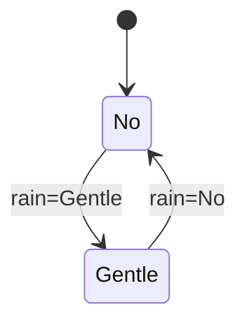

---

## 16. Sensor — Scene

**Module:** `home.appliance.sensor.scene`

A scene trigger sensor that mirrors a scene activation signal. When a scene fires it enters **Triggered**; when it is deactivated it returns to **Untriggered**.

### Monitored events

| Event | Values |
|-------|--------|
| `event.scene` | `Triggered`, `Untriggered` |

### State machine

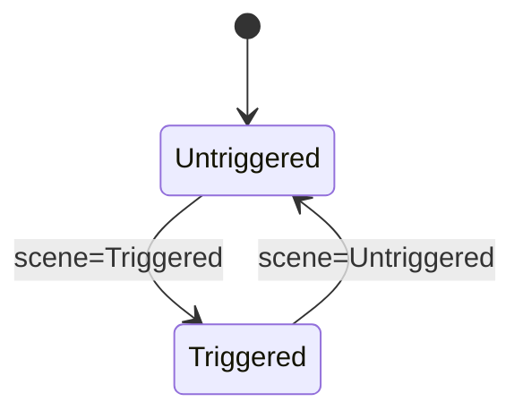

---

## 17. Sound Player

**Module:** `home.appliance.sound.player`

A multi-mode audio system with sleep-cycle awareness. When the occupant wakes up (`sleepiness=Awake`) it starts a **Fade In** (gradual volume ramp-up), timed by an elapsed event. When the occupant falls asleep from a forced-on state it starts a **Fade Out**. The user can force a fixed playlist/volume (**Forced On**) or an adaptive circadian-rhythm playlist (**Forced Circadian Rhythm**) at any time. A separate **Forced Off** state lets the user suppress the automatic wake-up fade-in. While forced on, if the occupant becomes sleepy (`sleepiness=Sleepy`) the player moves to a **Sleepy Forced On** state, keeping the same fixed playlist but switching to the sleepy volume; from there an `Awake` event returns it to **Forced On** and an `Asleep` event starts a **Fade Out**.

### Monitored events

| Event | Values |
|-------|--------|
| `event.presence` | `On`, `Off` |
| `event.sleepiness` | `Awake`, `Sleepy`, `Asleep` |
| `event.elapsed` | `On` (timer expired), `Off` (timer reset) |
| `appliance.sound.player.event.forced` | `Not`, `On`, `Off`, `CircadianRhythm` |

### State machine

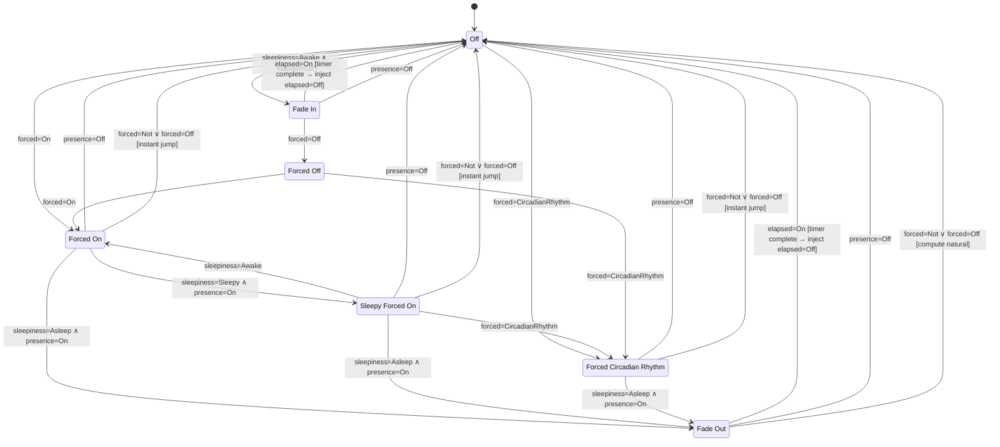

### Transitions summary

| From | Event | Condition | To |
|------|-------|-----------|-----|
| Off | sleepiness=Awake | elapsed=Off | Fade In |
| Off | forced=On | — | Forced On |
| Off | forced=CircadianRhythm | — | Forced Circadian Rhythm |
| Fade In | elapsed=On | — | Off (elapsed=Off injected) |
| Fade In | presence=Off | — | Off |
| Fade In | forced=Off | — | Forced Off |
| Forced On | sleepiness=Sleepy | presence=On | Sleepy Forced On |
| Forced On | sleepiness=Asleep | presence=On | Fade Out |
| Forced On | presence=Off | — | Off |
| Forced On | forced=Not \| Off | — | Off (instant jump) |
| Sleepy Forced On | sleepiness=Awake | — | Forced On |
| Sleepy Forced On | sleepiness=Asleep | presence=On | Fade Out |
| Sleepy Forced On | presence=Off | — | Off |
| Sleepy Forced On | forced=Not \| Off | — | Off (instant jump) |
| Sleepy Forced On | forced=CircadianRhythm | — | Forced Circadian Rhythm |
| Forced CR | sleepiness=Asleep | presence=On | Fade Out |
| Forced CR | presence=Off | — | Off |
| Forced CR | forced=Not \| Off | — | Off (instant jump) |
| Fade Out | elapsed=On | — | Off (elapsed=Off injected) |
| Fade Out | presence=Off | — | Off |
| Fade Out | forced=Not \| Off | — | natural state (Off) |
| Forced Off | forced=On | — | Forced On |
| Forced Off | forced=CircadianRhythm | — | Forced Circadian Rhythm |
