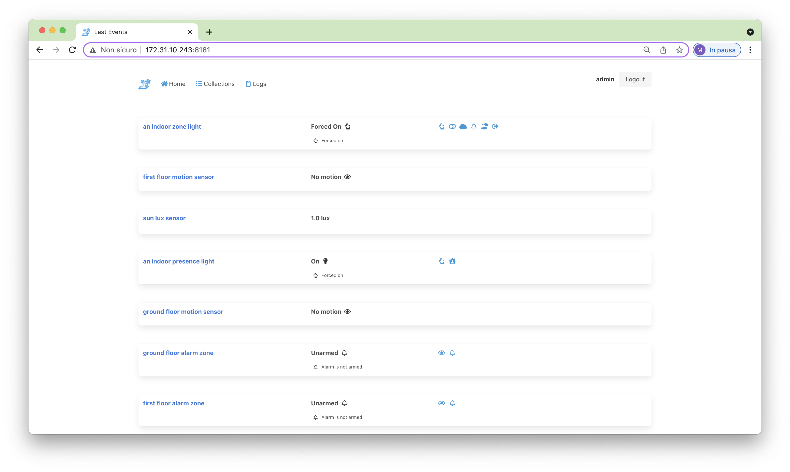
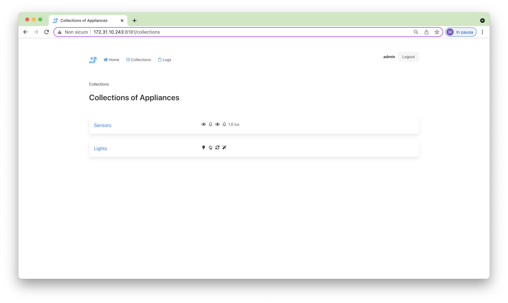
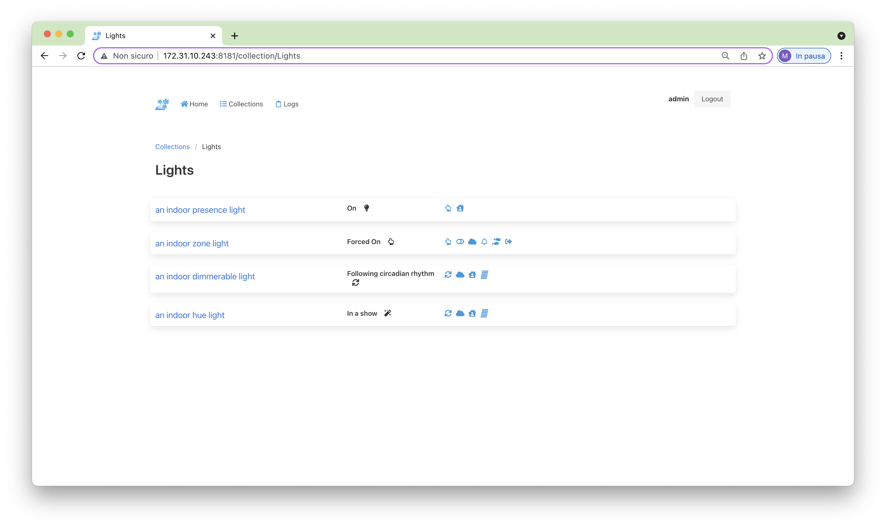
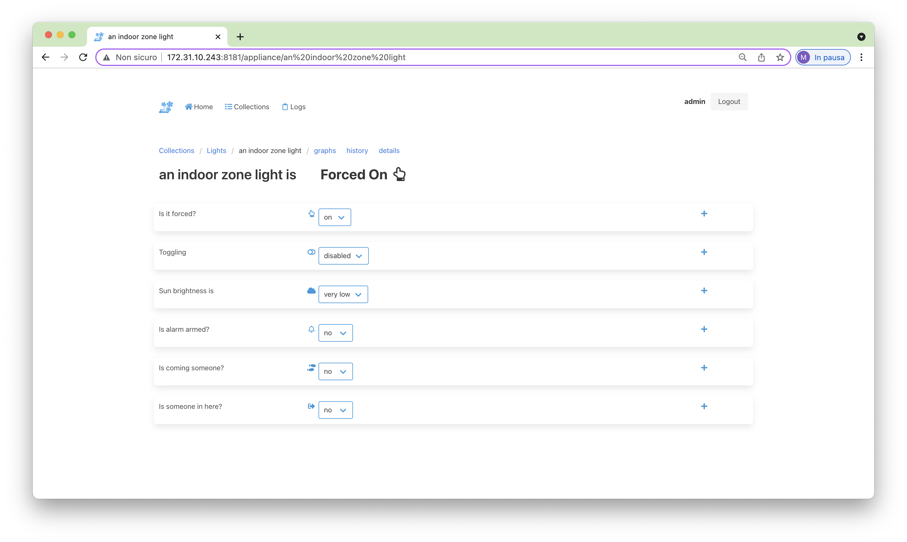
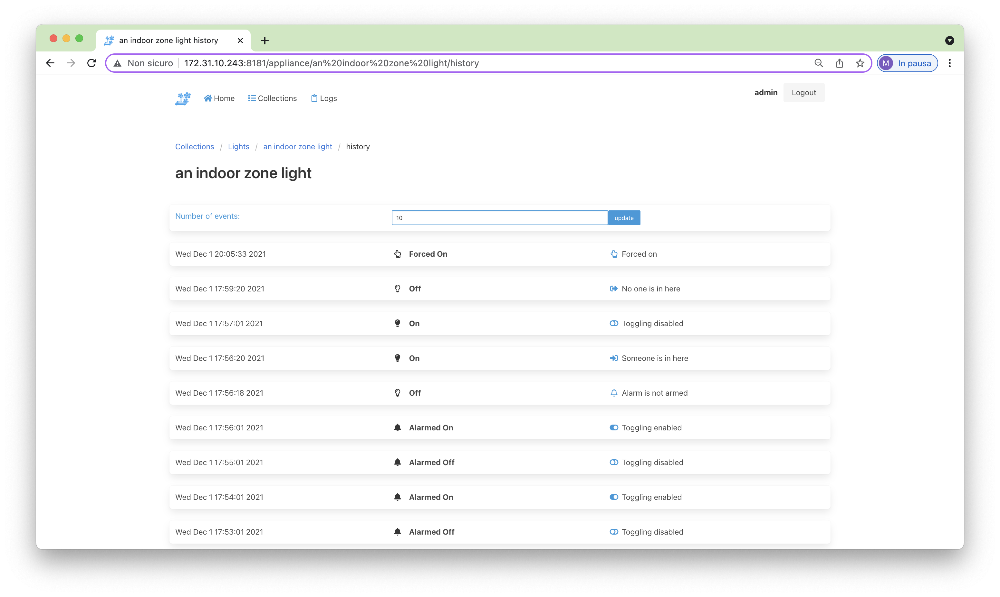
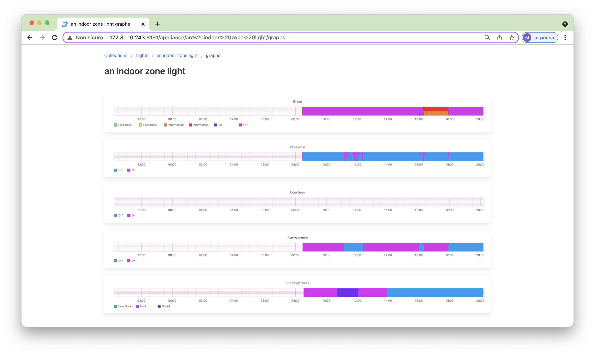

# Automate home

[](https://app.travis-ci.com/majamassarini/automate-home)
[](https://codecov.io/gh/majamassarini/automate-home)
[](https://automate-home.readthedocs.io/en/latest/?badge=latest)


Yet another home automation (iot) project because a **smart light is more than just on or off**.

## Overview

When talking about home automation there are at least two goals you could
have in mind:

1. let a user interact with the home devices through many interfaces locally or remotely
2. let devices interact together and let the system change their state

I believe the other home automation projects fit perfectly the first goal,
this project focuses on **automation**, the second one.

What's the difference between this project model and other home automation projects?

The main difference is the design of an *Appliance*, where by *Appliance* I mean entities such as a light, a curtain, a sound player, etc.

One of the simplest *Appliances* I could imagine is a light with two *physical states*: on and off.

A light model could be designed like a deterministic state machine; all the other home automation projects I know do it like that.

Or it could be designed like [a non deterministic state machine](https://www.google.com/url?sa=t&rct=j&q=&esrc=s&source=web&cd=&cad=rja&uact=8&ved=2ahUKEwjE_8OOjeTsAhVR26QKHe9iA4cQmhMwHHoECB8QAg&url=https%3A%2F%2Fen.wikipedia.org%2Fwiki%2FNondeterministic_finite_automaton&usg=AOvVaw27skSr2u7Pk_Ka8zz9O1j0>);
 which is how it is done by this project.

When using a deterministic state machine, if you have a light with on/off physical states, its model states will be just on/off.
When using a non-deterministic state machine it is easy to have more model states for an on/off light; for example,
your light could be in an *alarmed* state and start blinking.

### Behavior-driven development

I believe automations are the building blocks of a smart home system.
Nevertheless, they are complex to build, debug, and share, and one of this project's goals is to make it easier.

Having an *Appliance* group together all its logic **simplifies debugging and reuse**.

All *Appliances* inner states can be tested with [BDD](https://www.google.com/url?sa=t&rct=j&q=&esrc=s&source=web&cd=&cad=rja&uact=8&ved=2ahUKEwjqq7PHleTsAhXpA2MBHUVSC2wQFjAAegQIAhAC&url=https%3A%2F%2Fen.wikipedia.org%2Fwiki%2FBehavior-driven_development&usg=AOvVaw3zU0d2S_KiO3w9C0gwNWv_) style tests [like this](https://automate-home.readthedocs.io/en/latest/features/features.light_presence.feature-file.html).

BDD style tests make it quite easy to understand the behaviour of every *Appliance* in every possible state, making it more **shareable**.

**I like to think of this project as a way to share behavioural models for our smart devices more easily.**

### What this project is

***A proof of concept.***

This project allows me to create and test, in Python, *automation rules that can be more complex and more expressive*.

I made a draft (I am not a front-end developer) for a really simple web interface.
I can interact with the automation rules through the web interface.
Looking at the web interface I can always answer the most obvious questions: why the light is turning on/off, 
why the curtain is being closed/opened...

*I was tired of explaining why **some magic** was happening in my home.
I think I have built a system able to answer these questions by itself.*

I integrated really few protocols, the ones I am using the most at my home: [KNX](https://github.com/majamassarini/automate-knx-plugin), 
[Lifx](https://github.com/majamassarini/automate-lifx-plugin) and [Sonos](https://github.com/majamassarini/automate-sonos-plugin).

For all the other protocol integrations I needed I have used [Home Assistant](https://github.com/majamassarini/automate-home-assistant-plugin).

### automate-home vs Home Assistant

A natural question is: *why not just do all of this in Home Assistant?*

Home Assistant is unmatched as a **device gateway** — discovering and talking to an
enormous range of hardware, with a polished UI, mobile app, dashboards and voice
integration that this project would never match. That's exactly why an
[automate-home-assistant-plugin](https://github.com/majamassarini/automate-home-assistant-plugin)
exists: let Home Assistant be the gateway to the device world, and let *Appliances* be
the **behaviour** on top of it.

Where automate-home shines is modelling **genuinely stateful appliance behaviour** —
reacting to several independent event sources (presence, sleepiness, timers, user-forced
commands, device echoes) and combining them into a small number of explicit, named
states. Two things make that tractable here:

- **Reuse through real class hierarchies.** An *Appliance* type is written **once** —
  its states, transitions and guards — and every physical instance reuses that same,
  already-debugged logic; only the wiring to the physical device changes. In plain Home
  Assistant that behaviour ends up copy-pasted per device in YAML, or hand-rolled into a
  templated blueprint, mixing behaviour and wiring back together.

- **BDD tests as a regression net.** Every *Appliance* state and transition is covered
  by BDD style tests — hundreds of scenarios that pin down exactly how it reacts to every
  event in every state, the kind of timing- and ordering-sensitive coverage that's nearly
  impossible to get from poking a real device and watching what happens.

- **A richer vocabulary for reacting to raw bus data.** *Protocol Triggers* are a
  first-class, YAML-wireable concept here: you react not just to a single message on the
  bus, but to *patterns* in a stream of them. For example:

    - `protocol.mean.GreaterThan` / `LesserThan` / `InBetween` — average a sensor's
      readings over a rolling window and fire only once the *mean* crosses a threshold
      (e.g. wind speed or outdoor light level as "strong"/"weak"/"in between"), so a
      single noisy reading doesn't flip an appliance back and forth;
    - `protocol.multi.Trigger` — combine several independent triggers with
      positive/negative logic, e.g. turning separate zone sensors into a single "this
      zone just became occupied/empty" event;
    - `protocol.enum.Trigger` — step through a small enum of events each time a message
      arrives, e.g. a wall button cycling through "next/previous user";
    - `protocol.timer.Trigger` — fire a follow-up event some seconds after the original
      one, e.g. a scene that, once triggered, schedules itself to be undone later.

  In a pure Home Assistant setup this kind of stream-level reasoning is
  integration-internal Python that users don't get to wire themselves; here it's an open,
  composable layer you can build new appliance behaviour on without writing a plugin.

- **One Appliance, several cooperating protocols, one coherent state.** An *Appliance*
  only knows *what* it should be (e.g. "the light should be on"); the *Performer* layer
  maps that to actual protocol commands and reads protocol feedback back. So a single
  *Appliance* can be wired to devices speaking entirely different protocols — say a bulb
  on one wireless protocol switched by a wall unit on a wired bus — and the end user still
  sees and interacts with **one** light, with one well-defined state. In a pure Home
  Assistant setup the unit of modelling is the *entity*, normally one per
  device/integration; presenting such a pair as a single coherent thing means
  hand-building a group or templated entity (with its own scripts to reconcile both
  devices' states) plus an automation to keep them in sync — the same
  assemble-it-yourself-and-hope-it-stays-in-sync pattern, now applied to *cross-protocol*
  composition, and just as exercised by the BDD suite as everything else.

In short: reach for Home Assistant (or its plugin here) for **connectivity**. Reach for
an *Appliance* when the **behaviour** itself is the hard part.

## Documentation

For a deep dive into this project see the [documentation](https://automate-home.readthedocs.io/en/latest/?badge=latest).

For a minute guide to this project see the [landing page](https://majamassarini.github.io/automate-home).

For understanding how state machines process events and why some transitions may not work as expected, see [State Machine Event Processing](STATE_MACHINE_EVENT_PROCESSING.md).

For a detailed description of the runtime event loop and how protocol events, scheduler timers, and Redis broadcasts are routed through the appliance state machines, see [The Process Module](PROCESS.md).

For suggestions, questions or anything else, please, write here: [discussions](https://github.com/majamassarini/automate-home/discussions).

## Contributing

Pull requests are welcome!

## License

The automate-home project is licensed under GPL3.

## Example projects

The following are some example projects. 

These links point to a **static HTML example** of the final GUI you will obtain using the configuration files,
and to a github project with all the configuration files:

 * [lights models](https://majamassarini.github.io/automate-lights-example/pages/172.31.10.243/index.html) ([configuration](https://github.com/majamassarini/automate-lights-example))
 * [sockets models](https://majamassarini.github.io/automate-sockets-example/sockets/172.31.10.248/index.html) ([configuration](https://github.com/majamassarini/automate-sockets-example))
 * [curtain models](https://majamassarini.github.io/automate-curtains-example/pages/172.31.10.244/index.html) ([configuration](https://github.com/majamassarini/automate-curtains-example))
 * [sound player model](https://majamassarini.github.io/automate-sound-player-example/pages/172.31.10.247/index.html) ([configuration](https://github.com/majamassarini/automate-sound-player-example))

Ideally, you should be able to use the configuration files in the examples by changing: 
 * the ```configuration.ini``` file, adjusting the paths and the ip addresses;
 * the files in the ```performer``` directory, modifying the devices addresses 
   (if you have devices speaking the same protocol);
 * you can also change automation details in the ```scheduler_triggers``` directory

Maybe, this page can help me clarify what I mean: [landing page](https://majamassarini.github.io/automate-home).

Once the project configuration files fit your needs, you can use them in different ways.

### Installation

#### Docker image

You can use the following docker image 

```shell
docker pull majamassarini/automate-home:latest
```

#### Yocto build

You can build your personal Linux image with the automate-home framework for your favorite 
hardware using this [yocto distro meta layer](https://github.com/majamassarini/meta-automate-home).

#### Pip install

You can just pip install it, but you will not obtain nor the KNX USBHID daemon or the graphite server.

```shell
pip install automate-ws

python -m home --configuration-file configuration.ini
python -m ws --configuration-file configuration.ini
python -m graphite_feeder --configuration-file configuration.ini
```

## GUI Example

### Latest events



### Devices collections



### Lights



### State of a light



### Events history for a light



### Events graphs for a light




