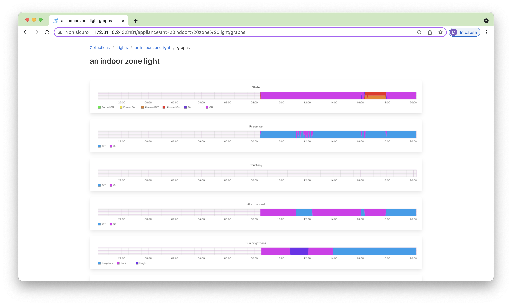

# Automate home

[](https://app.travis-ci.com/majamassarini/automate-home)
[](https://codecov.io/gh/majamassarini/automate-home)
[](https://automate-home.readthedocs.io/en/latest/?badge=latest)


Yet another home automation (iot) project because a **smart light is more than just on or off**.

## Overview

When talking about home automation there are at least two goals you could
have in mind:

1. let a user interact with the home devices through many interfaces locally or remotely
2. let devices interact together and let the system change their state

I believe the other home automation projects fits perfectly the first goal,
this project focuses on **automation**, the second one.

What's the difference between this project model and other home automation projects?

The main difference is the design of an *Appliance* where, with the name *Appliance*, I refer to entities like a light, a curtain, a sound player ecc.

One of the simplest *Appliances* I could imagine is a light with two *physical states*: on and off.

A light model could be designed like a deterministic state machine; all the other home automation projects I know do it like that.

Or it could be designed like [a non deterministic state machine](https://www.google.com/url?sa=t&rct=j&q=&esrc=s&source=web&cd=&cad=rja&uact=8&ved=2ahUKEwjE_8OOjeTsAhVR26QKHe9iA4cQmhMwHHoECB8QAg&url=https%3A%2F%2Fen.wikipedia.org%2Fwiki%2FNondeterministic_finite_automaton&usg=AOvVaw27skSr2u7Pk_Ka8zz9O1j0>);
 which is how it is done by this project.

When using a deterministic state machine if you have a light with on/off physical states its model states will be just on/off.
When using a non-deterministic state machine it is quite simple to have more model states for an on/off light, as an example, 
your light could be in an *alarmed* state and it could start blinking.

### Behavior-driven development

I believe logics are the building bricks of a smart home system.
Nevertheless, they are complex to build, debug and share and one of this project goals is to make it easier.

Having an *Appliance* grouping together all its logics **simplifies debug and reuse**.

All *Appliances* inner states can be tested with [BDD](https://www.google.com/url?sa=t&rct=j&q=&esrc=s&source=web&cd=&cad=rja&uact=8&ved=2ahUKEwjqq7PHleTsAhXpA2MBHUVSC2wQFjAAegQIAhAC&url=https%3A%2F%2Fen.wikipedia.org%2Fwiki%2FBehavior-driven_development&usg=AOvVaw3zU0d2S_KiO3w9C0gwNWv_) style tests [like this](https://automate-home.readthedocs.io/en/latest/features/features.light_presence.feature-file.html).

BDD style tests make it quite easy to understand the behaviour of every *Appliance* in every possible state and thus make it **shareable**.

**I like to think of this project as a way to share behavioural models for our smart devices more easily.**

### What this project is

***A proof of concept.***

This project allows me to create and test, through python, *automation rules (logics) which can be more complex and more expressive*.

I made a draft (I am not a front-end developer) for a really simple web interface.
I can interact with the automation rules (logics) through the web interface.
Looking at the web interface I can always answer the most obvious questions: why the light is turning on/off, 
why the curtain is being closed/opened...

*I was tired of explaining why **some magic** was happening in my home.
I think I have built a system able to answer these questions by itself.*

I integrated really few protocols, the ones I am using the most at my home: [KNX](https://github.com/majamassarini/automate-knx-plugin), 
[Lifx](https://github.com/majamassarini/automate-lifx-plugin) and [Sonos](https://github.com/majamassarini/automate-sonos-plugin).

For all the other protocol integrations I needed I have used [Home Assistant](https://github.com/majamassarini/automate-home-assistant-plugin).
I started writing an integration for *Home Assistant*, but it is not complete yet. 
I used it with few devices since it introduces a delay that I prefer not to have.

## Documentation

For a deep dive into this project see the [documentation](https://automate-home.readthedocs.io/en/latest/?badge=latest).

For a minute guide to this project see the [landing page](https://majamassarini.github.io/automate-home).

For suggestions, questions or anything else, please, write here: [discussions](https://github.com/majamassarini/automate-home/discussions).

## Contributing

Pull requests are welcome!

## License

The automate-home project is licensed under GPL3.

## Example projects

The following are some example projects. The links point to a **statical html example** of the final GUI you will obtain, 
and to the github project with the configuration files:

 * [lights models](https://majamassarini.github.io/automate-lights-example/pages/172.31.10.243/index.html) ([configuration](https://github.com/majamassarini/automate-lights-example))
 * [curtain models](https://majamassarini.github.io/automate-curtains-example/pages/172.31.10.244/index.html) ([configuration](https://github.com/majamassarini/automate-curtains-example))
 * [sound player model](https://majamassarini.github.io/automate-sound-player-example/pages/172.31.10.247/index.html) ([configuration](https://github.com/majamassarini/automate-sound-player-example))

Ideally you should be able to use them by changing: 
 * the ```configuration.ini``` file, adjusting the ip addresses;
 * the files in the ```performer``` directory, modifying the devices addresses 
   (if you have devices speaking the same protocol!);
 * you can also change automation details in the ```scheduler_triggers``` directory

Maybe, this page can help me clarify what I mean: [landing page](https://majamassarini.github.io/automate-home).

When, the project configuration fits your needs, you can use it in different ways.

### Installation

#### Docker image

You can use the following docker image 

```shell
docker pull majamassarini/automate-home:latest
```

#### Yocto build

Or you can build your personal Linux image with the automate-home framework for your favorite 
hardware using this [yocto distro meta layer](https://github.com/majamassarini/meta-automate-home).

#### Pip install

Or you can just pip install it, but you will not obtain nor the KNX USBHID daemon or the graphite server.

```shell
pip install automate-ws

python -m home --configuration-file configuration.ini
python -m ws --configuration-file configuration.ini
python -m graphite_feeder --configuration-file configuration.ini
```

## GUI Example

### Latest events


### Devices collections


### Lights


### State of a light


### Events history for a light


### Events graphs for a light




