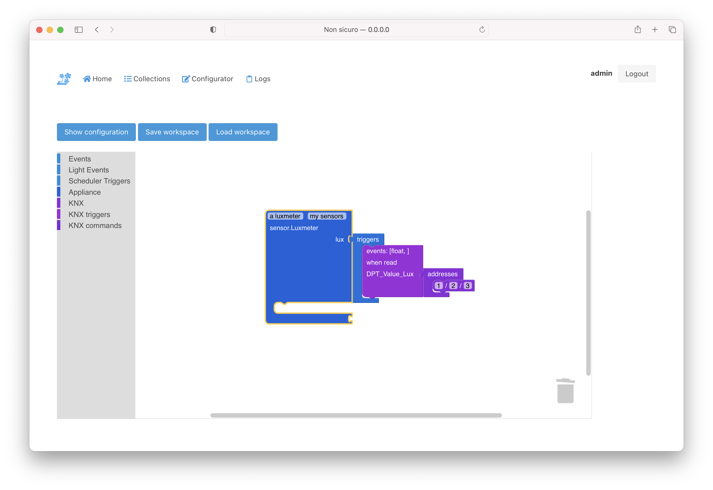

############
Architecture
############

What's the difference between this project model and other home automation projects?

The main difference is the design of an *Appliance* where, with the name *Appliance*, I refer to entities like a light model, a curtain model, a sound player model ecc.

One of the most simple *Appliances* I could imagine is a light with two states: on and off.

A light could be designed like a deterministic state machine.

Or it could be designed like a non deterministic state machine.

When a deterministic state machine is used there will exist only one model of light, *one able to receive the on and off messages* and
with two final states *on and off*.

When a non deterministic state machine is used it is quite simple to have *multiple models for the same light*.
These models will receive many different messages and will behave differently to the same messages.
Examples:

  * a simple light model, named presence light, which owns just two states **off** and **forced on**.
    The system will never turn on this kind of light but will turn it off when the user forgets it **forced on**.
    The system could know that the user forgot the light on if it receives a **presence off** message when, as an example,
    tha alarm system is armed in the light zone and no one is there anymore.

  * a light model for a highly busy zone, named busy zone light, which owns multiple states **on**, **off**, **forced on**, **forced off**.
    This light model is thought to be used, as an example, in a kitchen.
    The system turns it on when someone is in there and the sun brightness is low,
    unless the user already forced it off, and
    the system turns it off only if the sun brightness is very high unless the user forces it on.
    If no one is in there anymore the system will not turn the light off because in a busy zone probably a user will come back soon.

  * a more complex light model, named zone light, which owns multiple states **off**, **on**, **forced on**, **forced off**,
    **alarmed**.
    This light model is thought to be used, as an example, in a hall.
    The system turns it on if someone is coming or is in there and the sun brightness is low and
    turns it off when no one is in the light zone, near it or the sun brightness is high.
    The user can force the light on or off.
    If the alarm is armed in the hall zone and someone is coming, the light becomes
    alarmed and could start blinking, reminding the user that the alarm system has to be unarmed.

All those models have just one thing in common: **all of them need a device capable of understanding two commands**
to be realized, an **on** and an **off** command. But

- they could have many *internal states* like a **forced state** to shape their behaviour
- they could show their *internal states*, like a **presence state**, to be more informative to the user

*Protocol messages* are translated into *Appliance* messages by an entity called *Performer*.

*Appliance* states are translated into *Protocol commands* through the *Performer*.

.. note::
  Some of the system behaviours described above can be realized even without using a non deterministic state machine.
  Like all other projects do that.

  You need logics/rules using many variables holding the hidden state of the devices.

  **I believe it is more explicit and usable for the end user to have a state named alarmed (for a simple light)
  rather than to have an on state and an hidden variable somewhere in the rule engine.**

Example
-------

.. raw:: latex

    \clearpage

.. raw:: latex
    :file: ./latex/scenarios.tex

.. only:: html

  .. figure:: ./latex/scenarios.tex.svg
    :align: center

.. raw:: latex

    \clearpage

.. _debug-and-reuse:

Behavior-driven development
===========================

I believe logics are the building bricks of a smart home system.
But they are complex to build, debug and share and this project goal is to make it easier.

Having an *Appliance* grouping together all its logic **simplifies logic debug and reuse**.

All *Appliance* inner states can be tested with BDD style tests.

:ref:`BDD style tests <Features>` make it quite easy to understand the behaviour of every *Appliance* in every possible state and thus make it more **shareable**.

**I like to think of this project as a way to easily share behavioural models for our smart devices.**

Multi protocol Appliances
=========================

A feature of this project architecture is the freedom you have of **mixing different protocols** when interacting with an *Appliance*.

**Appliances are abstract non deterministic state machines**, they do not know how to turn on your light, they just know that your light should be turned on.

Suppose, as an example, your Lifx Bulb is switched on by a KNX Switch; you do not need to write a new model light.
The light *Appliance* is just one but you need to interact with two protocols and this project already has all you need
to switch on the Lifx Bulb via KNX protocol commands and setting its color via Lifx protocol commands.

**You can mix all the protocols commands and triggers you want when interacting with an Appliance**

.. raw:: latex

    \clearpage

.. raw:: latex
    :file: ./latex/scenarios_multiprotocol.tex

.. only:: html

  .. figure:: ./latex/scenarios_multiprotocol.tex.svg
    :align: center

.. raw:: latex

    \clearpage

############
Requirements
############

This is a **python 3** project using *asyncio* and:

 - APScheduler
 - aioredis
 - hiredis
 - pyephem
 - pytz
 - PyYAML

There is a draft for a simple web user interface based upon:

 - aiohttp
 - aiohttp-jinja2
 - multidict
 - jinja2
 - colour

There exists a **yocto meta layer** to build the project into an embedded system.

The *yocto* system is used to build **both an arm and a x86 docker container**.

This project consists of many different repositories:

 - `automate-home <https://github.com/majamassarini/automate-home>`_: the project core
 - `automate-ws <https://github.com/majamassarini/automate-ws>`_: a simple web server for the project
 - `automate-graphite-feeder <https://github.com/majamassarini/automate-graphite-feeder>`_: a simple graphite integration for the webserver
 - `automate-knx-plugin <https://github.com/majamassarini/automate-knx-plugin>`_: a *KNX* plugin for the project
 - `knx-stack <https://github.com/majamassarini/knx-stack>`_: a *KNX stack* used by the automate-knx-plugin
 - `automate-lifx-plugin <https://github.com/majamassarini/automate-lifx-plugin>`_: a *Lifx* plugin for the project
 - `lifx-lib <https://github.com/majamassarini/lifx-lib>`_: a *Lifx lan library* used by the automate-lifx-plugin
 - `automate-sonos-plugin <https://github.com/majamassarini/automate-sonos-plugin>`_: a *Sonos* plugin (using soco library) for the project
 - `automate-home-assistant-plugin <https://github.com/majamassarini/automate-home-assistant-plugin>`_: a *Home Assistant* plugin (using websocket) for the project

What is missing
===============

The project configuration is made through yaml files.
Yaml files are powerful but writing them is boring and error prone.

A user interface to **visually create** *Appliances, Performers, Scheduler Triggers, Protocol Triggers and Protocol Commands* is missing.

A draft for an editor with `blockly <https://developers.google.com/blockly>`_ is a work in progress.

