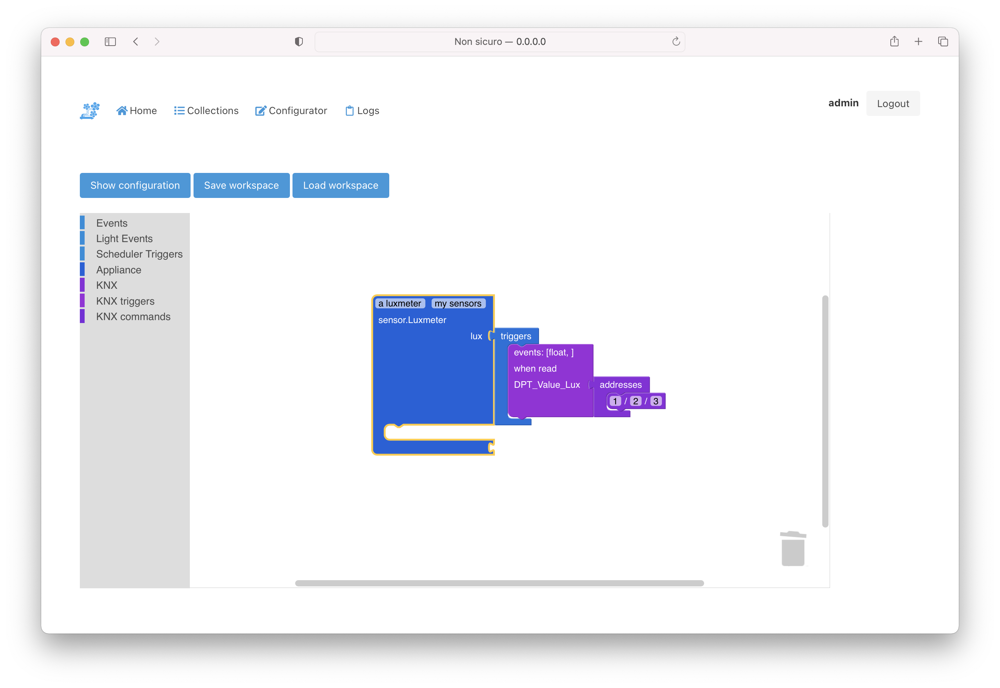

############
Architecture
############

What's the difference between this project model and other home automation projects?

The main difference is the design of an *Appliance*, where by *Appliance* I mean entities such as a light model, a curtain model, a sound player model, etc.

One of the most simple *Appliances* I could imagine is a light with two states: on and off.

A light could be designed like a deterministic state machine.

Or it could be designed like a non deterministic state machine.

When a deterministic state machine is used there will exist only one model of light, *one able to receive the on and off messages* and
with two final states *on and off*.

When a non deterministic state machine is used it is quite simple to have *multiple models for the same light*.
These models will receive many different messages and will behave differently to the same messages.
Examples:

  * a simple light model, named presence light, which owns just two states **off** and **forced on**.
    The system will never turn on this kind of light but will turn it off when the user forgets it **forced on**.
    The system could know that the user forgot the light on if it receives a **presence off** message when, as an example,
    the alarm system is armed in the light zone and no one is there anymore.

  * a light model for a highly busy zone, named busy zone light, which owns multiple states **on**, **off**, **forced on**, **forced off**.
    This light model is thought to be used, as an example, in a kitchen.
    The system turns it on when someone is in there and the sun brightness is low,
    unless the user already forced it off, and
    the system turns it off only if the sun brightness is very high unless the user forces it on.
    If no one is in there anymore the system will not turn the light off because in a busy zone probably a user will come back soon.

  * a more complex light model, named zone light, which owns multiple states **off**, **on**, **forced on**, **forced off**,
    **alarmed**.
    This light model is thought to be used, as an example, in a hall.
    The system turns it on if someone is coming or is in there and the sun brightness is low and
    turns it off when no one is in the light zone, near it or the sun brightness is high.
    The user can force the light on or off.
    If the alarm is armed in the hall zone and someone is coming, the light becomes
    alarmed and could start blinking, reminding the user that the alarm system has to be unarmed.

All those models have just one thing in common: **all of them need a device capable of understanding two commands**
to be realized, an **on** and an **off** command. But

- they could have many *internal states* like a **forced state** to shape their behaviour
- they could show their *internal states*, like a **presence state**, to be more informative to the user

*Protocol messages* are translated into *Appliance* messages by an entity called *Performer*.

*Appliance* states are translated into *Protocol commands* through the *Performer*.

.. note::
  Some of the system behaviours described above can be achieved without using a non-deterministic state machine,
  as other projects do.

  You would need rules using many variables to hold the hidden state of the devices.

  **I believe it is more explicit and usable for the end user to have a state named alarmed (for a simple light)
  rather than to have an on state and a hidden variable somewhere in the rule engine.**

Example
-------

.. raw:: latex

    \clearpage

.. raw:: latex
    :file: ./latex/scenarios.tex

.. only:: html

  .. figure:: ./latex/scenarios.tex.svg
    :align: center

.. raw:: latex

    \clearpage

.. _debug-and-reuse:

Behavior-driven development
===========================

I believe automations are the building blocks of a smart home system.
They are complex to build, debug, and share — and the goal of this project is to make it easier.

Having an *Appliance* grouping together all its logic **simplifies logic debug and reuse**.

All *Appliance* inner states can be tested with BDD style tests.

:ref:`BDD style tests <Features>` make it quite easy to understand the behaviour of every *Appliance* in every possible state, making it more **shareable**.

**I like to think of this project as a way to easily share behavioural models for our smart devices.**

Multi protocol Appliances
=========================

A feature of this project architecture is the freedom you have of **mixing different protocols** when interacting with an *Appliance*.

**Appliances are abstract non deterministic state machines**, they do not know how to turn on your light, they just know that your light should be turned on.

Suppose, as an example, your Lifx Bulb is switched on by a KNX Switch; you do not need to write a new model light.
The light *Appliance* is just one but you need to interact with two protocols and this project already has all you need
to switch on the Lifx Bulb via KNX protocol commands and setting its color via Lifx protocol commands.

**You can mix all the protocols commands and triggers you want when interacting with an Appliance**

.. raw:: latex

    \clearpage

.. raw:: latex
    :file: ./latex/scenarios_multiprotocol.tex

.. only:: html

  .. figure:: ./latex/scenarios_multiprotocol.tex.svg
    :align: center

.. raw:: latex

    \clearpage

automate-home vs Home Assistant
===============================

A natural question is: *why not just do all of this in Home Assistant?*

Home Assistant is unmatched as a **device gateway**: it discovers and talks to an enormous
range of hardware, ships a polished UI, mobile app, dashboards and voice-assistant
integration — things this project would have to reinvent and would never do as well.
This is exactly why an :doc:`automate-home-assistant-plugin <plugins>` exists: let Home
Assistant be the gateway to the device world, and let *Appliances* be the **behaviour**
on top of it.

Where this project shines, by contrast, is in modelling **genuinely stateful appliance
behaviour** — the kind that reacts to several independent event sources (presence,
sleepiness, elapsed timers, user-forced commands, device echoes) and needs to combine
them into a small number of *explicit, named states*. Two things make this tractable
here in a way that plain Home Assistant automations make hard:

- **Reuse through real class hierarchies.** An *Appliance* type — say
  ``sound.player.Appliance`` — is written **once**: its states, its transitions, its
  guards. Every physical instance reuses that exact same, already-debugged logic; only
  the *wiring* to the physical device (performers, protocol commands/triggers) is
  per-instance. In a pure Home Assistant setup that same behaviour would have to be
  either copy-pasted per device in YAML, or hand-rolled into a templated *blueprint* —
  a far weaker reuse mechanism than class inheritance, and one that mixes behaviour and
  wiring back together.

- **Behaviour-driven tests as a regression net.** Every *Appliance* state and transition
  is covered by :ref:`BDD style tests <Features>` — hundreds of scenarios that run in
  seconds and pin down exactly how the appliance reacts to every event in every state.
  This is what let real, subtle bugs surface and get fixed with confidence while
  developing the sound player's *Sleepy Forced On* state: a stale-event replay that
  spuriously re-triggered a fade-in on unforce, and a device-echo race where the
  appliance bounced itself back to *Off* milliseconds after entering the new state.
  Both are the kind of timing- and ordering-sensitive bugs that are painful to even
  *notice*, let alone fix and keep fixed, when the only way to test an automation is to
  poke a real device and watch what happens.

- **A richer vocabulary for reacting to raw bus data.** *Protocol Triggers* are a
  first-class, YAML-wireable concept here: you can react not just to a single message on
  the bus, but to *patterns* in a stream of them. In a real configuration this looks like:

    - ``protocol.mean.GreaterThan`` / ``LesserThan`` / ``InBetween`` — average a sensor's
      readings over a rolling window and fire only once the *mean* crosses a threshold,
      e.g. treating wind speed or outdoor light level as "strong"/"weak"/"in between" so a
      single noisy reading doesn't flip an appliance back and forth;
    - ``protocol.multi.Trigger`` — combine several independent triggers with
      positive/negative logic, e.g. turning four separate zone sensors into a single
      "this zone just became occupied/empty" event;
    - ``protocol.enum.Trigger`` — step through a small enum of events each time a message
      arrives, e.g. a wall button cycling through "next/previous user" so the same
      physical control drives different people's preferences;
    - ``protocol.timer.Trigger`` — fire a follow-up event some seconds after the original
      one, e.g. a "watch tv" scene that, once triggered, schedules the lights to switch
      off again later on its own.

  In a pure Home Assistant setup this kind of stream-level reasoning is integration-internal
  Python that users don't get to wire themselves; here it's an open, composable layer you
  can build new appliance behaviour on without writing a plugin.

In short: reach for Home Assistant (or its plugin here) for **connectivity** — discovering
and commanding devices, dashboards, notifications, voice. Reach for an *Appliance* when
the **behaviour** itself is the hard part: when you have several states, several event
sources, and edge cases worth getting right and keeping right over time.

############
Requirements
############

This is a **python 3** project using *asyncio* and:

 - APScheduler
 - aioredis
 - hiredis
 - ephem
 - pytz
 - PyYAML

There is a draft for a simple web user interface based upon:

 - aiohttp
 - aiohttp-jinja2
 - multidict
 - jinja2
 - colour

There exists a **yocto meta layer** to build the project into an embedded system.

The *yocto* system is used to build **both an arm and a x86 docker container**.

This project consists of many different repositories:

 - `automate-home <https://github.com/majamassarini/automate-home>`_: the project core
 - `automate-ws <https://github.com/majamassarini/automate-ws>`_: a simple web server for the project
 - `automate-graphite-feeder <https://github.com/majamassarini/automate-graphite-feeder>`_: a simple graphite integration for the webserver
 - `automate-knx-plugin <https://github.com/majamassarini/automate-knx-plugin>`_: a *KNX* plugin for the project
 - `knx-stack <https://github.com/majamassarini/knx-stack>`_: a *KNX stack* used by the automate-knx-plugin
 - `automate-lifx-plugin <https://github.com/majamassarini/automate-lifx-plugin>`_: a *Lifx* plugin for the project
 - `lifx-lib <https://github.com/majamassarini/lifx-lib>`_: a *Lifx lan library* used by the automate-lifx-plugin
 - `automate-sonos-plugin <https://github.com/majamassarini/automate-sonos-plugin>`_: a *Sonos* plugin (using soco library) for the project
 - `automate-home-assistant-plugin <https://github.com/majamassarini/automate-home-assistant-plugin>`_: a *Home Assistant* plugin (using websocket) for the project

What is missing
===============

The project configuration is made through yaml files.
Yaml files are powerful but writing them is boring and error prone.

A user interface to **visually create** *Appliances, Performers, Scheduler Triggers, Protocol Triggers and Protocol Commands* is missing.

A draft for an editor with `blockly <https://developers.google.com/blockly>`_ is a work in progress.

